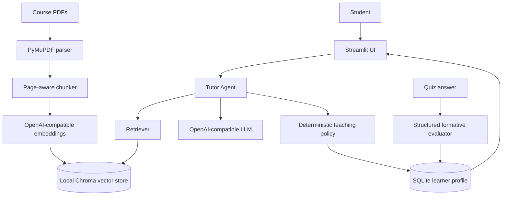

# EduAgent

**An Agentic AI Tutor for Personalized Course Learning**

EduAgent is a portfolio MVP that turns lecture PDFs into a course-grounded learning loop. It combines RAG, structured LLM outputs, a lightweight learner profile, and a deterministic teaching policy.

## Why EduAgent?

An ordinary PDF chatbot usually performs:

```text
question → retrieval → answer
```

EduAgent adds a learning state and a next-action loop:

```text
student state + course evidence + current response
                     ↓
              Tutor Agent
                     ↓
       explanation / example / quiz / remediation
                     ↓
              formative feedback
                     ↓
              mastery update
                     ↓
            next teaching action
```

The MVP does not claim that its heuristic is validated knowledge tracing or that it has demonstrated learning gains.

## Features

- Page-aware PDF ingestion with duplicate detection
- Course-grounded retrieval using Chroma
- Source citations such as `lecture_05.pdf — Page 12`
- Beginner, Standard, and Advanced explanations
- Multiple-choice and short-answer quiz generation
- Structured automated formative feedback
- Concept mastery and weak-concept detection
- Deterministic adaptive teaching policy
- Streamlit learning, practice, progress, materials, and About pages
- Technical retrieval evaluation with an offline demo mode
- Streamlit Community Cloud deployment preparation

## Architecture



## Quick start

The implementation is currently on the `codex/eduagent-mvp` branch.

```bash
git clone https://github.com/Magician026/EduAgent.git
cd EduAgent
git checkout codex/eduagent-mvp
uv venv --python 3.12 .venv
source .venv/bin/activate
uv pip install -r requirements.txt -r requirements-dev.txt
uv pip install -e .
cp .env.example .env
# Edit .env and set OPENAI_API_KEY and OPENAI_MODEL
streamlit run app.py
```

Without an API key, the application still starts and shows configuration guidance, About content, local progress storage, and the materials shell. Real indexing, grounded answers, quizzes, and evaluation require a configured OpenAI-compatible provider.

## Configuration

```env
OPENAI_API_KEY=
OPENAI_BASE_URL=
OPENAI_MODEL=gpt-4o-mini
OPENAI_EMBEDDING_MODEL=text-embedding-3-small
EDUAGENT_DATA_DIR=data
EDUAGENT_RETRIEVAL_TOP_K=5
```

`OPENAI_BASE_URL` is optional. Set it when using an OpenAI-compatible provider. Secrets are loaded from environment variables or Streamlit secrets and are never committed.

Runtime Chroma files, SQLite data, and uploaded course materials belong under `data/runtime/` and are ignored by Git. The MVP intentionally uses a single local/demo student rather than collecting personal information.

## Demo content and technical evaluation

The repository contains self-authored sample content:

```bash
python examples/create_sample_pdf.py
PYTHONPATH=src python -m eduagent.evaluation.rag_evaluator \
  --dataset examples/evaluation_dataset.json
```

The offline evaluator reports source hit rate, source recall, latency, and provider errors. Its default CLI uses a small lexical retriever over the self-authored sample PDF so it can run without an API key. This is a reproducible technical smoke evaluation, not a claim about production RAG quality or educational impact.

The production application uses provider embeddings and Chroma. A future evaluation can call `evaluate_dataset` with the real `Retriever` and a controlled answer function.

## Deployment: Streamlit Community Cloud

Deployment is prepared but has not been performed by this repository agent.

1. Create/select a Streamlit Community Cloud app from `Magician026/EduAgent`.
2. Choose branch `codex/eduagent-mvp` until the branch is merged.
3. Set the main file to `app.py`.
4. Use Python 3.12 if the deployment UI exposes a Python version selector.
5. Add these flat secrets in the app settings:

```toml
OPENAI_API_KEY = "your-key"
OPENAI_BASE_URL = ""
OPENAI_MODEL = "gpt-4o-mini"
OPENAI_EMBEDDING_MODEL = "text-embedding-3-small"
```

6. Deploy and perform the flow in `docs/demo.md`.

The local filesystem on a hosted app may be ephemeral. Do not upload sensitive course or student data until appropriate privacy, retention, access-control, and institutional review requirements are addressed.

## Screenshots to take after deployment

- Course Materials page with an indexed sample PDF
- Learn page showing a grounded answer and expanded source card
- Practice page showing a quiz and formative feedback
- Progress page showing mastery and weak concepts
- About page showing architecture and limitations

Do not add screenshots that imply measured learning gains or real student usage.

## Educational impact study design

See [`docs/impact_study.md`](docs/impact_study.md). It is a future study design only; no participants, outcomes, or learning gains are claimed here.

## Limitations

- Single-student MVP without authentication or multi-user isolation
- Local Chroma and SQLite persistence; hosted filesystem durability is not guaranteed
- No OCR for scanned PDFs
- Automated answer evaluation is formative feedback, not official grading
- Mastery uses a transparent heuristic, not validated knowledge tracing
- Retrieval and generation quality depend on PDF text quality and provider configuration
- No real educational impact experiment has been conducted

## Roadmap

- Validated knowledge tracing and calibration
- Course concept/prerequisite graphs
- Spaced repetition
- Multi-course and multi-user support
- Instructor analytics
- Controlled learning-impact study

## Interview preparation

See [`docs/demo.md`](docs/demo.md) for the two-to-three-minute demo and interview questions. See [`docs/cv_material.md`](docs/cv_material.md) for truthful project bullets.
